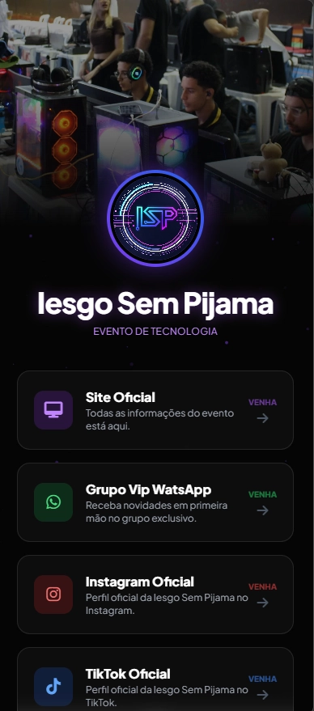
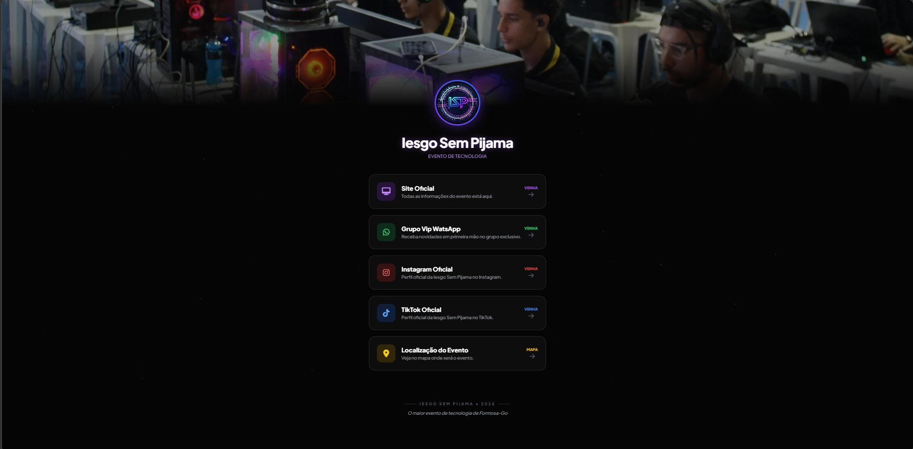

🚀 Iesgo Sem Pijama | Linktree Premium - RyhanC. 👨🏽‍💻

Projeto de página estilo Linktree moderno e animado desenvolvido para o evento tecnológico Iesgo Sem Pijama, realizado em Formosa-GO.

A proposta é centralizar todos os links importantes do evento em uma única página, com um design imersivo, responsivo e com animações suaves.

---
👨🏽‍💻 Ryhan Camilo Campos

Projeto desenvolvido para o evento Iesgo Sem Pijama.

---

🚀 Acesse o nosso site:

👉 [Ver site online](https://linktree-isp.netlify.app/)

---

Preview 💫

- Versão de Mobile




- Versão de PC




Uma landing page com:
- Banner animado com transição automática.
- Fundo interativo com partículas (canvas).
- Cards de links com efeito glassmorphism.
- Animações suaves (entrada + hover).
- Layout totalmente responsivo.

---

Tecnologias utilizadas:
- HTML5
- CSS3 (Custom + animações)
- JavaScript (Vanilla)
- Tailwind CSS
- Font Awesome
- Google Fonts (Plus Jakarta Sans)

---

## 📂 Estrutura do projeto

```bash
📁 linktree-isp/
├── index.html
├── css/
│   └── style.css
│   └── output.css
├── js/
│   └── script.js
│   └── lazy.js
└── img/
    ├── Banner01.webp
    ├── Banner02.webp
    ├── Banner04.webp
    ├── Banner0.webp
    └── Logo-Isp.webp
```
---

⚙️ Funcionalidades

🎞️ Banner dinâmico
- Rotação automática a cada 5 segundos
- Efeito de zoom suave
- Overlay com gradiente para melhor leitura

🌌 Background animado
- Partículas renderizadas via <canvas>
- Movimento aleatório contínuo
- Performance otimizada

🔗 Cards interativos
- Efeito glassmorphism
- Hover com brilho e elevação
- Ícones dinâmicos
- Animação de entrada (slideUp)

📱 Responsividade
- Mobile-first
- Compatível com qualquer dispositivo

---

❓ Como usar:
- Clone o repositório e abra o index.html:
```bash
git clone https://github.com/RyhZera/linktree-isp.git
```
---

⚡ Otimizações já aplicadas
- Imagens em formato .webp
- preload nos banners
- lazy loading em imagens secundárias
- Transições otimizadas com transform e opacity

---

📄 Licença

Este projeto é livre para uso e modificação para fins educacionais.

---
